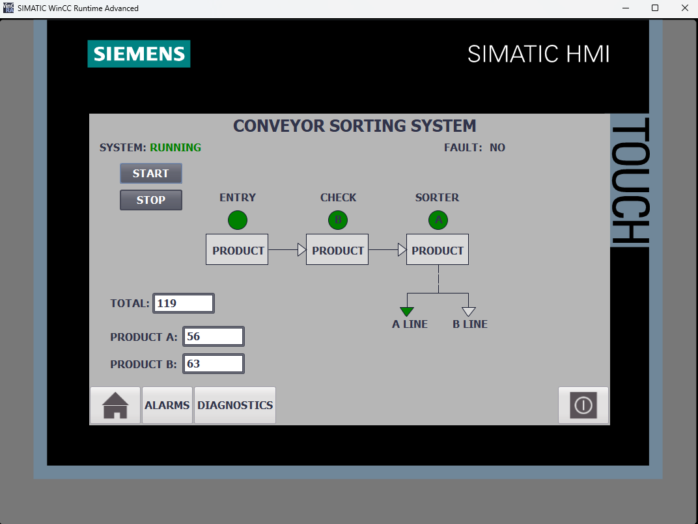
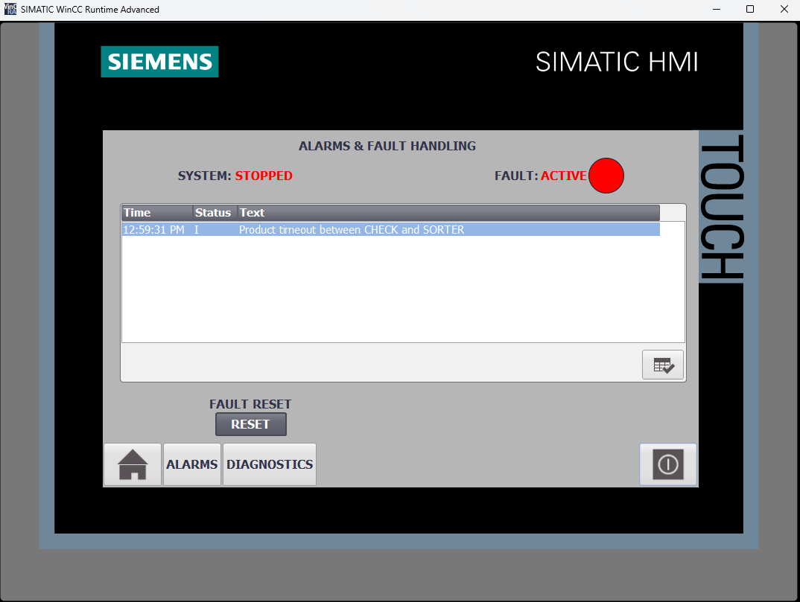
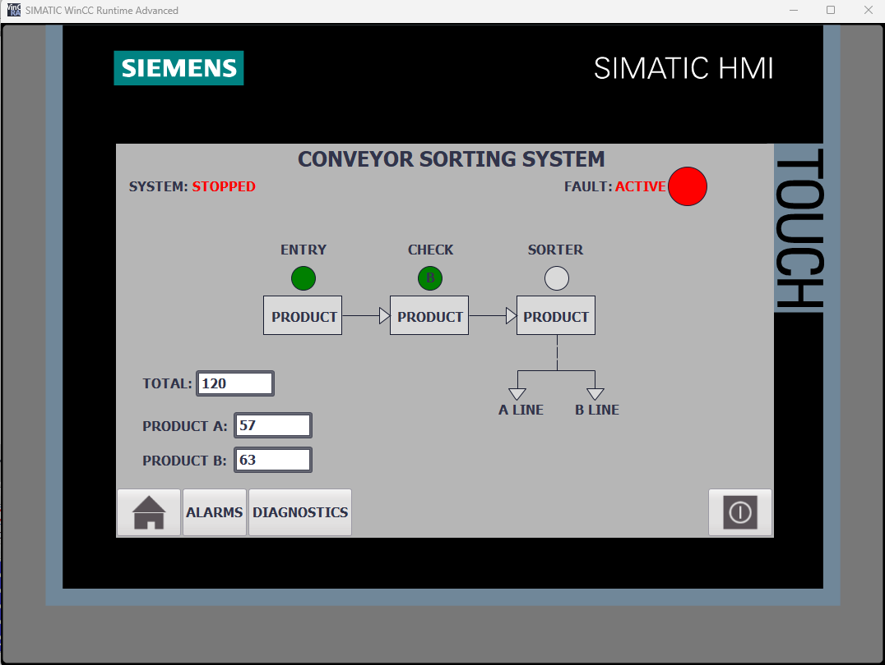
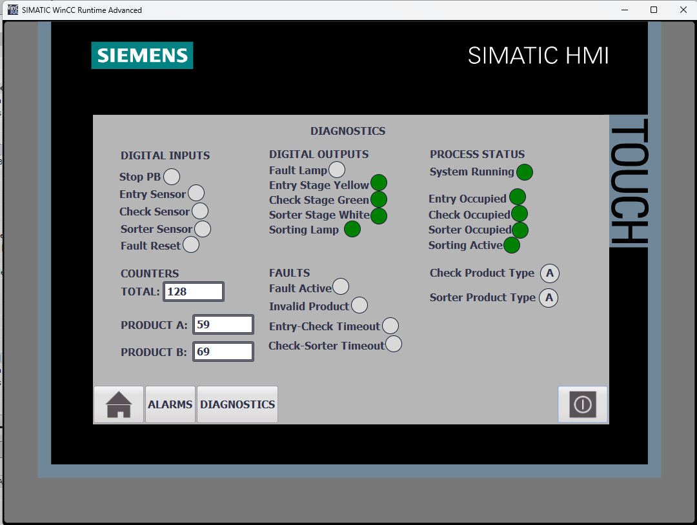

# S7-1200 Conveyor Sorting System

A PLC-based conveyor sorting system designed to simulate the detection, identification and sorting of products into two separate lines.

The project was developed in **TIA Portal V17** using a physical **Siemens S7-1200 CPU 1212C DC/DC/DC**.  
The control logic was written in **LAD**, and a **WinCC HMI** was created for process visualization, alarm handling and diagnostics.

## Features

The project includes:

- Automatic product flow through ENTRY, CHECK and SORTER zones
- Detection of products using simulated conveyor sensors
- Identification of two product types: A and B
- Automatic sorting of products to A LINE or B LINE
- Randomized product type generation
- Monitoring of product presence in each conveyor zone
- Product counters for type A, type B and total production
- Detection of invalid products
- Timeout monitoring between ENTRY and CHECK
- Timeout monitoring between CHECK and SORTER
- Automatic process stop when a fault occurs
- Fault indication using a physical lamp and HMI
- Fault reset from a physical push button or HMI
- Alarm visualization using WinCC Alarm View
- HMI diagnostic screen for PLC inputs, outputs and process states

## Hardware and Software

**Hardware:**

- Siemens S7-1200 CPU 1212C DC/DC/DC
- 24 V DC power supply
- Physical push buttons
- Signal lamps
- Custom training panel

**Software:**

- Siemens TIA Portal V17
- LAD (Ladder Logic)
- WinCC Runtime Advanced

## System Operation

The conveyor process is divided into three main zones:

### ENTRY

The ENTRY sensor detects a new product entering the system.

The product is then transferred toward the CHECK zone.

### CHECK

At the CHECK zone, the system determines whether the product is type **A** or **B**.

The detected product type is stored and transferred with the product to the sorting stage.

### SORTER

At the SORTER zone, the product is directed to the correct output line:

- Product A → **A LINE**
- Product B → **B LINE**

The corresponding product counter is incremented after sorting.

## HMI

### Main Overview

The main HMI screen provides an overview of the complete sorting process.

It displays:

- System RUNNING / STOPPED status
- Fault status
- ENTRY, CHECK and SORTER zone states
- Product type at CHECK and SORTER
- Active sorting direction
- Total product counter
- Product A counter
- Product B counter

### Alarm & Fault Handling

The system monitors the movement of products between conveyor zones.

If a product does not reach the next zone within the expected time, a timeout fault is generated. The process is stopped and the fault is displayed in the HMI alarm view.

The fault state is also clearly indicated on the main HMI screen.

### Diagnostics

A dedicated diagnostics screen provides direct visualization of PLC and process signals.

It includes:

- Digital input states
- Digital output states
- Conveyor zone occupancy
- Sorting activity
- Product types
- Product counters
- Active fault states

## Fault Handling

The project includes detection of several abnormal process conditions:

- Invalid product
- ENTRY → CHECK timeout
- CHECK → SORTER timeout

When a fault is detected:

1. The sorting process is stopped.
2. The fault lamp is activated.
3. The corresponding alarm is displayed on the HMI.
4. The operator can identify the cause using the alarm or diagnostics screen.
5. After the cause is removed, the fault can be reset using the physical reset button or HMI.

## Product Counters

The PLC keeps track of:

- Total sorted products
- Product A count
- Product B count

The counters are displayed directly on the main HMI screen and on the diagnostics screen.

## Testing

Functional tests were performed using the physical S7-1200 PLC setup and WinCC HMI.

The tests included:

- START and STOP operation
- Product detection at ENTRY
- Product transfer between conveyor zones
- Product type A detection and sorting
- Product type B detection and sorting
- Correct routing to A LINE and B LINE
- Product counters
- Invalid product detection
- ENTRY → CHECK timeout detection
- CHECK → SORTER timeout detection
- Automatic process stop after a fault
- Fault indication
- Fault reset
- Alarm visualization
- HMI operation
- Diagnostics screen operation

All tested functions operated as expected.

## Project Files

The complete TIA Portal V17 project archive is available here:

[`TIA_Project/S7-1200_Conveyor_Sorting.zap17`](TIA_Project/S7-1200_Conveyor_Sorting.zap17)

The PLC program printout is available here:

[`Documentation/PLC_Program.pdf`](Documentation/PLC_Program.pdf)

## Language

The PLC program was originally developed in English.  
Repository documentation is provided in English.

## Note

This is an educational project created for learning PLC programming, HMI development, process diagnostics and industrial automation concepts.

The conveyor process is simulated using physical inputs, outputs and PLC logic rather than a complete physical conveyor installation.
